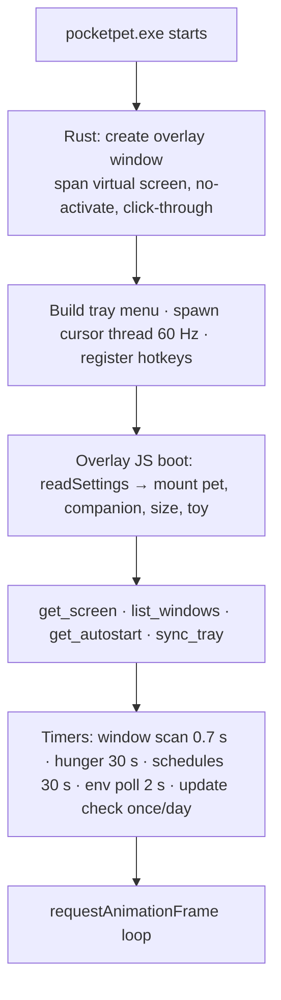
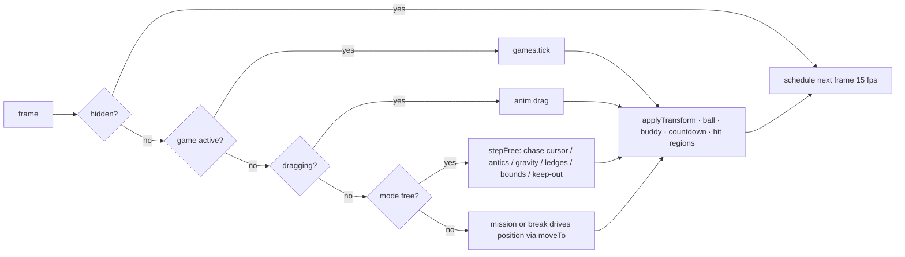
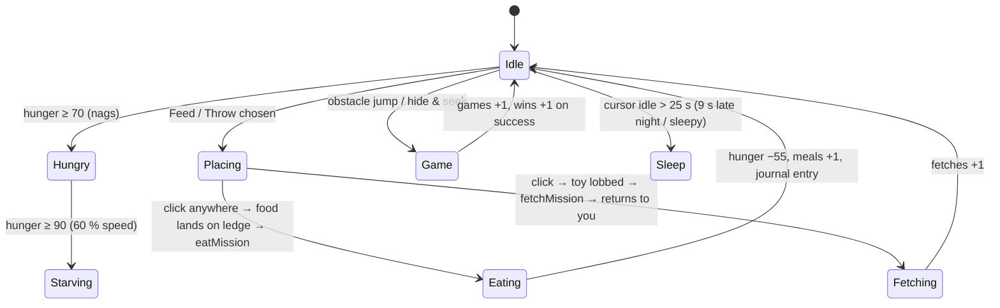
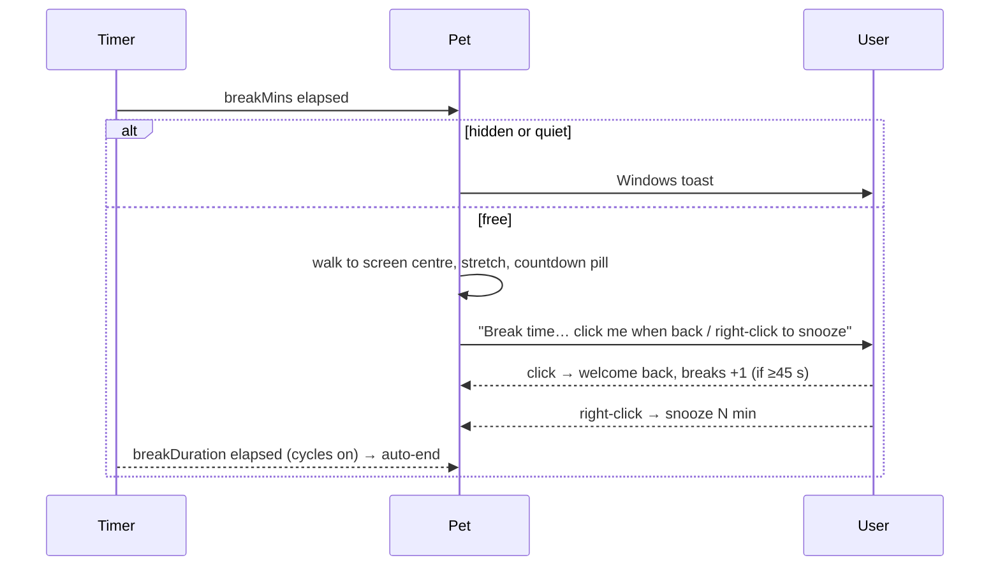
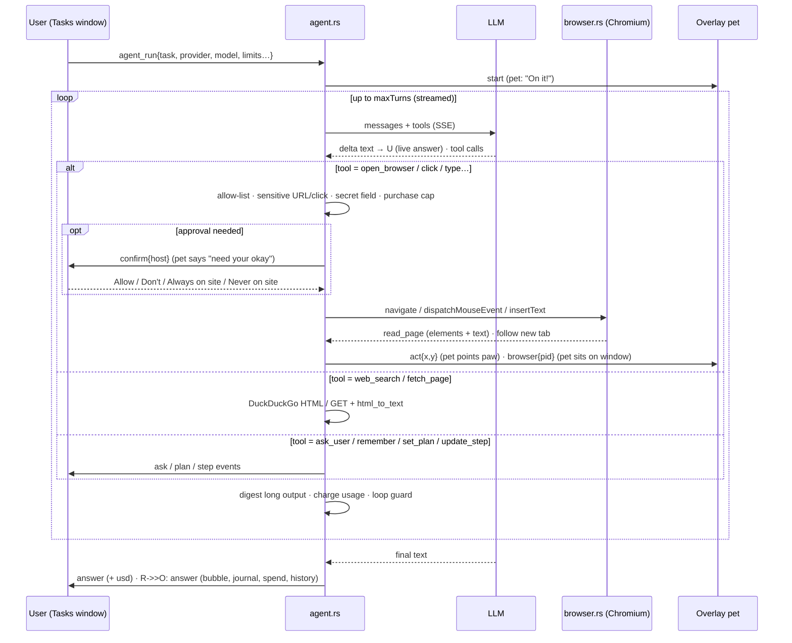

# PocketPet — App Flow

Version 0.1 · September 2026

## 1. Launch

First run: fresh settings from `preferences.js` defaults; hunger 20 %; no keys;
tray shows **Ask me to do something…**, **Settings…**.

## 2. Every frame (overlay)

Hit regions (pet, bubble, menu, buddy, game controls) are sent to Rust only
when they change; the cursor thread flips click-through per frame.

## 3. Interaction map

| User does | What happens |
|-----------|--------------|
| Moves mouse | Pet walks/runs after it, hops ledges, climbs to a window above |
| Hovers ≥ 0.9 s | Purr, hearts, `pets` +1 |
| Click | Pat, `pats` +1; during a break: ends break |
| Double-click | Hops onto the active window's titlebar and perches |
| Drag & drop | Gentle drop mid-air → perches; throw → flies, lands with squash |
| Right-click | HTML menu (keyboard-navigable): tasks, feed, toy, games, stats, window actions, pets, toggles, settings |
| Tray | Same actions + size/speed/break radios, autostart, hide, tasks, settings |
| Ctrl+Alt+P / F / B / S / T / V / D / X | Hide-show / feed / toy / settings / tasks / voice / clipboard task / kill switch |

## 4. Care loop

Milestones (bow/star/crown) unlock from per-pet counters; the dashboard in
Settings shows counters, milestones and the journal.

## 5. Breaks & focus

Focus mode: `get_environment` every 2 s → fullscreen app or quiet hours →
**quiet** (no chatter/sounds/nags/wandering) or **hide** (restores itself).

## 6. Task agent — end to end

Stop conditions: answer, error, cancelled (Cancel / kill switch / 15-min
unanswered question), spend cap, max turns.

### 6.1 Approval card outcomes

| Button | Effect |
|--------|--------|
| Allow | reply "yes" → click proceeds |
| Don't | reply "no" → tool error "owner declined" → model asks or stops |
| Always allow on this site | saves `siteRules[host]="allow"` + Allow |
| Never on this site | saves `siteRules[host]="never"` + Don't |
| (question) Send | free-text reply returned to the model as `Owner replied: …` |

### 6.2 Where things are written

| Data | Writer | Location |
|------|--------|----------|
| Settings, history, spend | Overlay (single writer), settings/tasks windows for their own fields | localStorage `pocketpet` |
| Keys | `agent_set_key` | Credential Manager `PocketPet/<provider>` |
| Memory | `remember` tool, Memory tab | `%LOCALAPPDATA%\PocketPet\memory.md` |
| Task logs | `emit()` in agent.rs | `%LOCALAPPDATA%\PocketPet\tasks\<id>.log` |
| Crashes | panic hook | `%LOCALAPPDATA%\PocketPet\logs\panic-<ts>.log` |
| Browser profile | Chromium | `%LOCALAPPDATA%\PocketPet\browser\` |

## 7. Voice

- **Windows engine**: 🎤 or Ctrl+Alt+V → `windows_listen` (OS listens until a pause) → text appended to the task box.
- **Whisper engine**: hold 🎤 (or toggle with Ctrl+Alt+V) → MediaRecorder webm → `agent_transcribe` → Groq/OpenAI Whisper → text.
- Read-aloud: answers and approval questions spoken with the pet's pitch/rate when enabled.

## 8. Schedules

Overlay checks every 30 s: enabled schedule, matching day, within 10 min after
its time, not run today, no task running → `agent_run` with id `sched-…` →
answer narrated + toast + history.

## 9. Updates

Daily (or Settings › Backup › Check): `GET releases/latest` → compare tag with
`CARGO_PKG_VERSION` → pet mentions it → **Download & install** fetches the
`-setup.exe` asset to `%TEMP%`, launches it, exits the app.
